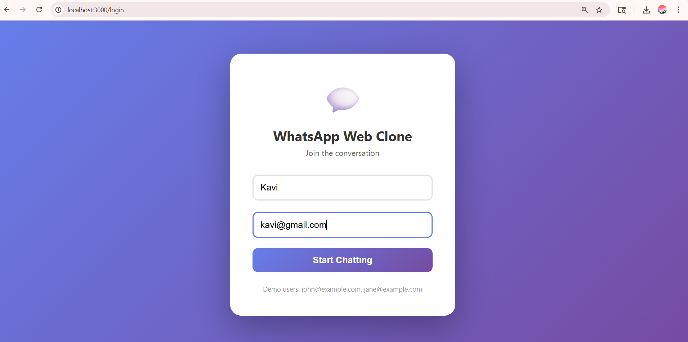
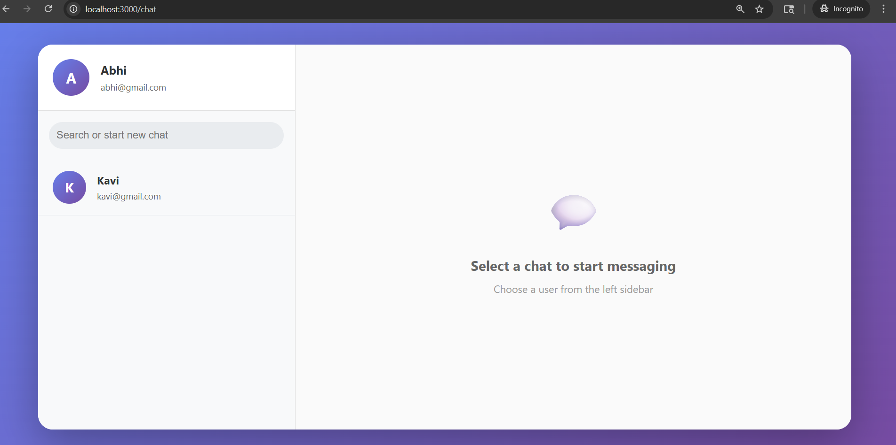
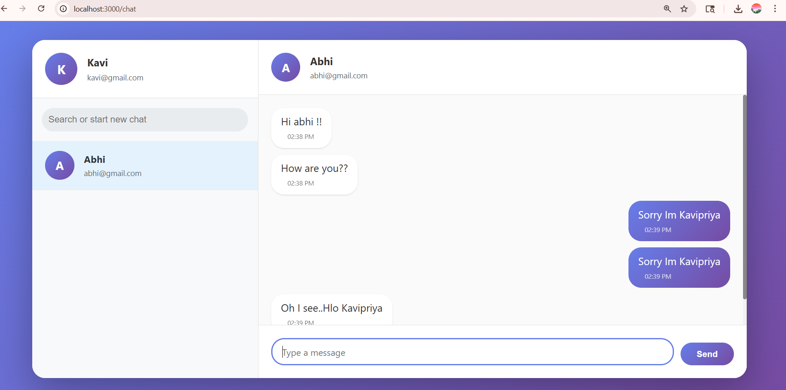
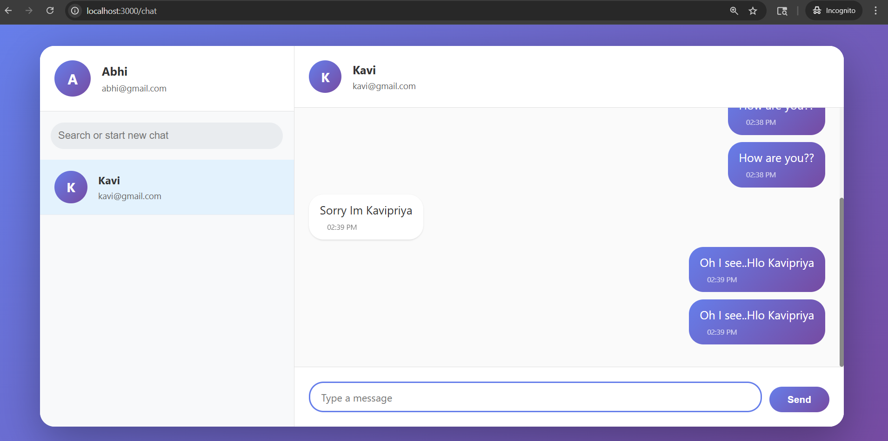

# WhatsApp Web Clone

A full-stack WhatsApp Web clone built with React, Node.js, Socket.IO, and MongoDB.

## Features

- ✅ User creation and authentication
- ✅ Real-time messaging using Socket.IO
- ✅ Two-panel chat interface
- ✅ Message persistence with MongoDB
- ✅ Automatic scroll to latest message
- ✅ Visually distinct sent/received messages
- ✅ Responsive design

## Tech Stack

### Frontend
- React 18
- React Router for navigation
- Axios for HTTP requests
- Socket.IO client for real-time updates
- CSS for styling

### Backend
- Node.js with Express
- Socket.IO for WebSocket connections
- MongoDB with Mongoose ODM
- JWT for authentication

## Prerequisites

- Node.js (v14 or higher)
- MongoDB (local or cloud instance)
- npm or yarn

## Installation

### 1. Clone the repository

```bash
git clone https://github.com/yourusername/whatsapp-clone.git
cd whatsapp-clone
```

### 2. Backend Setup
```bash
cd backend
npm install
Create a .env file in the backend directory:

env
PORT=5000
MONGODB_URI=mongodb://localhost:27017/whatsapp_clone
JWT_SECRET=your_jwt_secret_key_here
Start the backend server:


npm run dev  # For development with auto-reload
# OR
npm start    # For production

```
### 3. Frontend Setup
Open a new terminal:

```bash
cd frontend
npm install
Start the frontend development server:


npm start
The application will open at http://localhost:3000
```

## Usage
Creating Users
Open the application in two different browsers (or use incognito mode)

Create two different users with unique usernames and emails

Example users:

User 1: username "John", email "john@example.com"

User 2: username "Jane", email "jane@example.com"

## Starting a Chat
After logging in, you'll see a list of other users

Click on a user to start chatting

Type your message and press Enter or click Send

Messages appear instantly on both sides

## Screenshots

### Login Page


### Chat Interface


### Message Exchange


